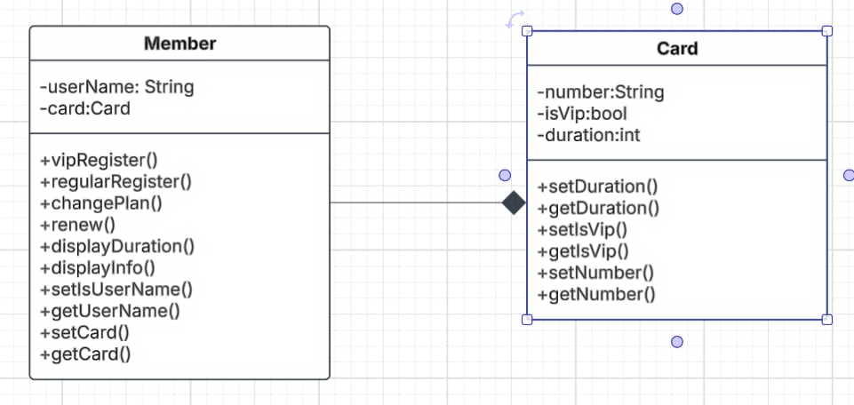

Фитнессийн гишүүнчлэлийн эрх
Хэрэглэгчдэд фитнессийн гишүүнчлэлийн эрхийг олгох бөгөөд энэ нь тухайн хэрэглэгчийн нэр, гишүүнчлэлийн төрөл, гишүүнчлэлийн карт, болон эрхийн хүчинтэй хугацаатай уялдана.

Гишүүнчлэлийн эрх нь хоёр үндсэн төрөлтэй байна:

Энгийн гишүүнчлэл – үндсэн үйлчилгээнүүдэд хандах боломжтой,

Тусгай гишүүнчлэл – нэмэлт үйлчилгээ, хөнгөлөлт, VIP хэсэг ашиглах эрх зэрэг давуу талуудтай.

Гишүүн бүрт тусгай карт олгогдож, уг карт нь тухайн хүний гишүүнчлэлийн мэдээлэл болон эрхийн хугацааг агуулна.

Гишүүд өөрсдийн гишүүнчлэлийн эрхийг:

Хугацаа дуусахаас өмнө сунгах,

Гишүүнчлэлийн төрлөө өөрчлөх (жишээлбэл, энгийнээс тусгай ангилал руу шилжих),
боломжтой байх юм.

Мөн систем нь гишүүдийн бүртгэлийг удирдах, гишүүнчлэлийн өөрчлөлтийг бүртгэх, сунгалтыг хянах боломжийг олгоно.

Класс: гишүүн 
Атрибут: нэр
Метод: vipбүртгүүлэх,энгийн бүртгүүлэх, эрх сунгах, эрхээ өөрчлөх, мэдээллээ харах 

Класс : карт
Атрибут: төрөл, дугаар 
Метод: vip эсэх 

.png>)
